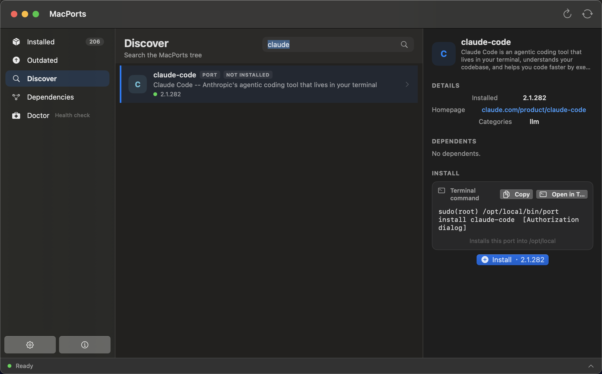
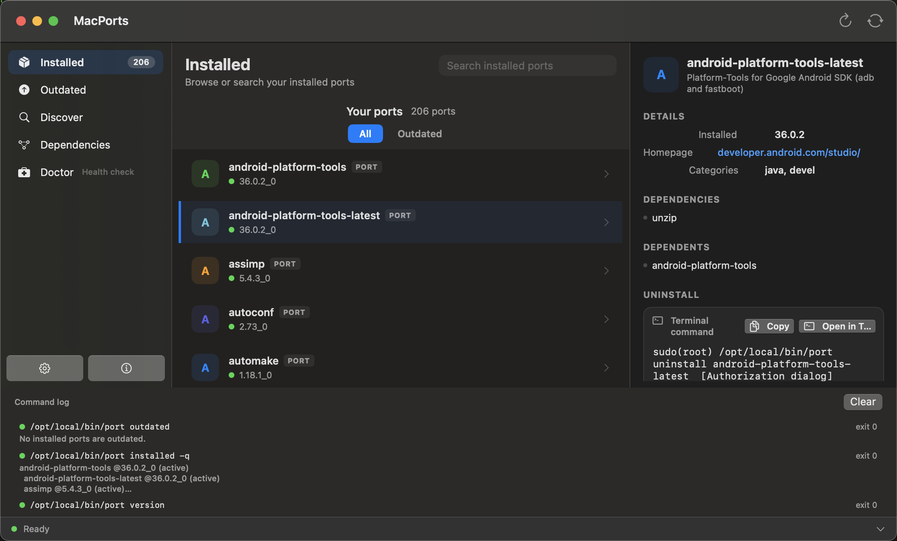

# MacPorts UI（MacPorts）

原生 macOS 应用，为 [MacPorts](https://www.macports.org/) 提供图形化界面：浏览已安装/过时端口、搜索软件源、查看依赖图、执行安装/升级/移除等写操作，并内置 MacPorts 健康诊断（Doctor）。

- 支持架构：**Apple Silicon（arm64/aarch64）与 Intel（x86_64）** —— 发布包为 universal 二进制
- 构建方式：Swift Package Manager（SPM），**无需 Xcode，Command Line Tools 即可编译**
- 运行环境：macOS 13 Ventura 及以上

---

## 界面快照

| 发现与安装（Discover） | 已安装列表与详情（Installed） |
|---|---|
|  |  |

- **001** — Discover 页：搜索 MacPorts 软件源（如 `claude`），右侧详情面板展示版本、主页、依赖关系，并提供终端命令复制与一键安装；
- **002** — Installed 页：已安装端口列表（All / Outdated 过滤）与详情（依赖、被依赖、卸载命令），底部为每次 `port` 调用的命令日志。

> 更多界面：Outdated（过时端口）、Dependencies（依赖图）、Doctor（健康诊断）、Settings / About 面板。

---

## 功能特性

| 功能 | 说明 |
|------|------|
| 已安装端口 | 列表浏览、详情面板、磁盘占用统计 |
| 过时端口 | 对比已安装与最新版本，支持一键升级 |
| 软件源搜索 | 调用 `port search`，支持关键词与包名过滤 |
| 依赖图 | 可视化端口依赖关系（依赖/被依赖两种视角） |
| 写操作 | 安装 / 升级 / 移除，均需确认弹窗 + 提权（系统授权对话框，可回退 sudo 密码） |
| Doctor 诊断 | 针对 MacPorts 安装树的三层健康检查（探针 → 事实 → 纯函数判定） |
| 日志视图 | 记录每次 `port` 调用的输出 |
| 设置 | 持久化保存提权方式偏好、启动刷新行为 |

---

## 软件架构

### 分层设计

项目分为三层，边界清晰、可测试性强：

```
┌─────────────────────────────────────────────────────────────┐
│  MacPortsUI（可执行目标，SwiftUI 外壳）                       │
│  MacPortsUIApp + Views/（Sidebar、DetailPane、GraphView、    │
│  DoctorPage、LogView、SettingsPanel …）                      │
│  · 纯 UI：视图、手势、导航                                    │
│  · 不直接调用任何 MacPorts 命令                               │
├─────────────────────────────────────────────────────────────┤
│  MacPortsUICore（库目标，纯 Foundation + Combine）           │
│  · MacPortsService —— 面向 UI 的服务门面（@MainActor         │
│    ObservableObject，发布可观察状态）                         │
│  · PortRunner / ProcessSpawner —— 以子进程方式调用 `port`    │
│    CLI（ShellEscape 防注入）                                  │
│  · Parsers —— 解析 port 文本输出（installed/info/outdated/  │
│    diskusage 等）                                            │
│  · PrivilegeExecutor —— 写操作提权：系统 osascript 授权      │
│    对话框（默认）或 sudo 密码（回退）                         │
│  · Doctor —— 健康检查（Probes/Facts/Checks 三层，纯函数判定） │
│  · DependencyGraph / Models / SettingsStore                  │
│  · 不依赖 SwiftUI，可完全单元测试                            │
├─────────────────────────────────────────────────────────────┤
│  系统层                                                      │
│  · MacPorts（`port` 可执行文件）—— 所有实际状态都通过它读取    │
│  · SQLite3（Sources/SQLite3 的 C shim）—— 预留直读            │
│    registry.db 的能力，当前版本仍走 CLI，链接为 no-op         │
└─────────────────────────────────────────────────────────────┘
```

关键设计决策：

- **读不写、读写分离**：所有读操作直接调用 `port`，无需提权；写操作统一经过 `PrivilegeExecutor` 并在 UI 上有显式确认步骤。
- **CLI 作为数据源**：不解析 MacPorts 内部数据库格式（避免随版本漂移），以 `port` 官方输出为准；SQLite 直读能力已预留。
- **UI 与核心解耦**：核心库零 SwiftUI 依赖，测试速度快、无 UI 干扰。

### 目录结构

```
.
├── Package.swift              # SPM 清单（macOS 13+，三个 target）
├── Sources/
│   ├── MacPortsUICore/        # 核心库：模型、解析器、CLI 运行器、服务门面
│   ├── MacPortsUI/            # SwiftUI 可执行目标（视图 + @main）
│   └── SQLite3/               # sqlite3 C shim（预留）
├── Tests/MacPortsUITests/     # 单元测试（解析器、Doctor、依赖图、设置等）
├── Scripts/
│   ├── build.sh               # 一键管线：测试 → 调试构建 → 发布打包
│   ├── make-app.sh            # 分架构构建 + lipo → universal .app（ad-hoc 签名）→ .zip/.dmg
│   └── release.sh             # 发版脚本：打包 + 归档到 release/（统一命名 MacPorts-latest.*）+ git tag +（可选）GitHub Release
├── Resources/icon-master.png  # 应用图标源文件（建议 1024×1024）
└── release/                   # 恒为最新版的发布产物（统一命名，随 git 提交）
    ├── MacPorts-latest.zip
    ├── MacPorts-latest.dmg
    ├── MacPorts-latest.sha256
    └── MacPorts-latest.meta.json  # 记录当前 latest 对应的版本/日期
```

### 数据流（以"升级端口"为例）

1. 用户在 UI 确认写操作 → `MacPortsService` 通过 `PrivilegeExecutor` 选择提权方式
2. 生成并显示将要执行的命令（`displayCommand`），用户再次确认
3. `ProcessSpawner` 以提权方式执行 `port upgrade <name>`
4. 输出流入日志视图与 `WriteOutcome`，刷新相关列表

---

## 构建与运行（开发者）

前置条件：macOS 13+、Xcode Command Line Tools（`swift build` 可用），以及已安装 MacPorts（`/opt/local/bin/port` 存在；未安装时应用会显示 "MacPorts Not Found" 提示）。

```sh
# 一键完整管线：单元测试 → 调试构建 → 发布打包（universal .app + .zip/.dmg）
sh Scripts/build.sh

# 常用变体
sh Scripts/build.sh --no-tests   # 跳过单元测试
sh Scripts/build.sh --no-app     # 只做开发构建
sh Scripts/build.sh --app-only   # 只出发布包

# 或直接用 SPM
swift build && swift run MacPortsUI

# 跑单元测试
swift test
```

产物：

- `dist/MacPorts.app` —— 本地 universal 应用（ad-hoc 签名）
- `dist/MacPorts-v<VERSION>.zip` / `.dmg` —— 版本化发布产物

调试界面钩子（仅开发用，正式发布前应移除，见 [MacPortsUIApp.swift](Sources/MacPortsUI/MacPortsUIApp.swift)）：

```sh
MPUI_DEMO=graph     ./run     # 直接打开"依赖图"页
MPUI_DEMO=sheet     ./run     # 打开写操作确认弹窗
MPUI_DEMO=about     ./run     # 打开"关于"
MPUI_DEMO=doctor    ./run     # 打开 Doctor 诊断页
MPUI_DEMO=settings  ./run     # 打开设置
MPUI_DEMO=nomacports ./run    # 模拟未安装 MacPorts 的告警
```

---

## 安装与使用（最终用户）

1. 从 [Releases 页面](https://github.com/jhonconal/macports-ui/releases) 下载对应版本的 `.dmg` 或 `.zip`；或克隆本仓库直接使用 `release/` 目录下的 `MacPorts-latest.dmg` / `MacPorts-latest.zip`（始终为最新版，一个 universal 包同时适用于 Apple Silicon 与 Intel Mac）。
2. DMG 内含 `.app` 与 `Applications` 快捷方式，**拖拽安装**；ZIP 直接解压得到 `MacPorts.app`。
3. 首次打开如被 Gatekeeper 拦截（本发布包为 ad-hoc 签名，未公证），任选其一：
   - 在 **系统设置 → 隐私与安全性** 中点击"仍要打开"；或
   - 终端执行：`xattr -d com.apple.quarantine /Applications/MacPorts.app`
4. 启动应用。若未安装 MacPorts，应用会提示检测失败；安装 MacPorts（`sudo port selfupdate` 后确认 `/opt/local/bin/port` 存在）即可使用。
5. 写操作（安装/升级/移除）默认弹出 **系统授权对话框**；也可在"设置"中切换为 sudo 密码方式。

---

## 获取与更新版本（git 流程）

本仓库保证用户"永远能下载到软件"，采用 **git 标签 + GitHub Releases** 双通道：

- **最新正式版**：GitHub 仓库的 **Releases** 页自动置顶 "Latest release"；仓库 Releases 列表按时间保留全部历史版本，可随时回看与下载旧版本。
- **仓库内备份通道**：`release/` 目录**只保留最新版**，统一命名为 `MacPorts-latest.{zip,dmg,sha256,meta.json}`（`meta.json` 标注对应的版本号与日期），每次发版由 `Scripts/release.sh` 覆盖更新；`git clone` 即可离线获取最新软件，旧版本仍可回看 GitHub Releases 与 git 历史。
- **更新方式**：本应用**没有内置自动更新**（未接入 Sparkle 等）。升级方式 = 下载新版 Release 包覆盖安装旧版；旧版包不会自动消失，用户可随时在 Releases 列表下载旧版本。

### 发布一个新版本（维护者）

```sh
# 一键发版：universal 打包 → 归档到 release/（统一命名 MacPorts-latest.*）→ 打 git tag v<版本>
# 如安装了 gh CLI 并已登录，还会自动创建 GitHub Release 并上传版本化产物
sh Scripts/release.sh 0.2.0

# 仅构建 + 打 tag（手动创建 GitHub Release）
sh Scripts/release.sh 0.2.0 --no-gh
```

发版约定：

1. 版本号采用 `X.Y.Z` 三段式；脚本会校验格式。
2. 产物命名分两处：`dist/` 中为版本化名 `MacPorts-v<VERSION>.zip/.dmg`（供 GitHub Release 上传，保留每个版本）；`release/` 中统一归档为 `MacPorts-latest.*`（每次发版覆盖，随 tag 一起推送进 git）。
3. 推送 tag 后在 GitHub 创建 Release（`gh release create vX.Y.Z dist/MacPorts-vX.Y.Z.dmg dist/MacPorts-vX.Y.Z.zip --generate-notes`），Releases 页即可"最新 + 全部历史"浏览下载。
4. 每个 Release 建议附简短的变更说明（changelog）。

---

## 注意事项

1. **签名与公证**：发布包目前为 **ad-hoc 签名、未经 Apple 公证**。直接分发时用户会触发 Gatekeeper 提示（见上文绕过方法）。如需免提示分发，请用 Developer ID 证书签名 + `notarytool` 公证（可在 CI 中完成），并保留 universal 构建流程。
2. **写操作需提权**：安装/升级/移除依赖 `port` 的写权限，应用会弹出系统授权或要求 sudo 密码；拒绝提权不会损坏系统，操作只是不执行。
3. **依赖外部 CLI**：所有数据来自 `/opt/local/bin/port`（可用设置项覆盖路径）。MacPorts 未安装时应用降级为"未检测到"状态，不会崩溃。
4. **demo 钩子**：`MPUI_DEMO` 环境变量用于开发演示，**正式对外发布前应从 `MacPortsUIApp.swift` 中移除**（代码中已标注 TEMPORARY）。
5. **SQLite shim 是预留项**：`Sources/SQLite3` 与 `linkedLibrary("sqlite3")` 当前没有实际功能，直读 `registry.db` 是后续计划；不要假设它存在可用接口。
6. **多架构构建原理**：发布脚本按架构分别 `swift build` 后再 `lipo` 合并为 universal 二进制（Command Line Tools 无法一次多架构编译）；CI 上可用 `ARCHS=x86_64` 等环境变量限制架构做测试。
7. **macOS 版本下限**：最低支持 macOS 13，使用 SwiftUI 相关 API 时请以 `Package.swift` 中的 `.macOS(.v13)` 为准。
8. **产物不入 dist/**：`dist/` 已被 `.gitignore` 忽略；进 git 的是 `release/` 目录，其中**恒为最新版**（统一命名 `MacPorts-latest.*`，每次发版覆盖；`meta.json` 记录对应版本号，git 历史保留所有旧版文件）。

---

## 许可证

本项目采用 **MIT** 许可证发布（见 [`LICENSE`](LICENSE) 文件）。

> 注意：本工具与 MacPorts 本身（GPL-2.0）相互独立；MIT 只约束本仓库代码与产物。
